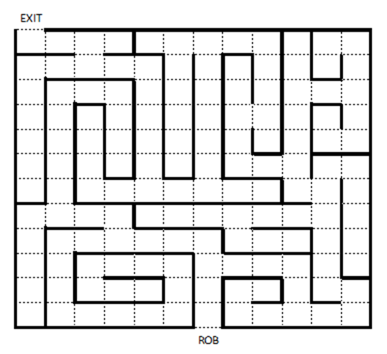

# Java8And17Learner
Java 8 to 17 practice set with all the features of the latest version.

# Function Questions
1. What is Functional Interface?
   > https://www.javaprogramto.com/2020/05/java-8-function-examples.html
   >>
   > https://www.scaler.com/topics/functional-interface-in-java/
   > >
   > https://www.baeldung.com/java-8-functional-interfaces
2. How Functional Interface is different than a nested class or anonymous class?
   > https://www.tutorialspoint.com/differences-between-anonymous-class-and-lambda-expression-in-java
   >> 
   > https://blog.knoldus.com/java-lambda-vs-anonymous-class/
   >>
   > https://medium.com/@knoldus/lambda-expression-vs-anonymous-inner-class-31adb0b3e482
   >> 
   > https://medium.com/swlh/super-basic-java-anonymous-class-functional-interface-and-lambda-expression-fba411a787
   >> 
   > https://stackoverflow.com/questions/22637900/java8-lambdas-vs-anonymous-classes
3. What is Function chaining in the functional interface?
4. How will you implement your own function chaining using the function interface?
5. How to use IntStream to create a List?
6. Why do we need to merge-function in Collectors.toMap to overcome IllegalStateException: Duplicate key? What is its internal architecture?

# Coding Questions
1. Write a code where you have been provided with a List of Products and tou have to provide me details of the Product along with its Latest version.
   > MapStructVerIdentifierMain.class
2. Implementation of function chaining and various types of function chaining.
   > FactorialExample.class
   >>
   > NestedFunctionalMethods.class
3. The following program prints,
   a)  “Happy Face” text when you feed a child with “Ice Cream” and
   b)  “Angry Face” text when you feed a child with “Salad” and
   c)  “Normal Face” text when you feed a child with “Milk”
   d)  "Error Face" text if you do not feed child with either "Ice Cream", "Salad" or "Milk"

   public static void main(String[] args) {
        BufferedReader reader = new BufferedReader(new InputStreamReader(System.in));
        System.out.println("Feed Child With Ice Cream, Salad or Milk To See Child's Face Reaction : ");
        String food = reader.readLine();
        if (food.equalsIgnoreCase("Ice Cream")) {
           System.out.println("Happy" + " " + "Face");
        } else if (food.equalsIgnoreCase("Salad")) {
           System.out.println("Angry" + " " + "Face");
        } else if (food.equalsIgnoreCase("Milk")) {
           System.out.println("Normal" + " " + "Face");
        } else {
           System.out.println("Error" + " " + "Face");
        }
   }

   There are different ways you can refactor above code and remove/replace “if else if” 
   conditionand print the same output. Write code snippets of minimum 3 possible ways you 
   can think the above code can be refactored and explain each approach.
      > By using Map, Enums and Switch cases.

4. Design a custom Word Dictionary that provides definitions about the words. Users should be able to lookup specific words and find their corresponding definitions, add/remove words with definitions and search words partially.
   The dictionary should have a unique definition for the given word and these words are case insensitive. Please implement the below WordDictionary class without using built-in java HashMap.

   WordDictionary {
   
       public WordDictionary() {
           // initializes the WordDictionary
       }
           
       public void insertWord(String word, String definition) {
           // Inserts the word and corresponding definition into the dictionary, if the word already exists, it will override the word and definition
       }	
       
           public String findDefinition(String word) {
               // Returns the definition for the word
           }
       
       public List<String> partialSearch(String partialWord) {
   // Returns the definitions for the words that are matched partially
   }
   
       public void remove(String word) {
           // Removes the word with definition from the dictionary
       }
   }
   > Code available in the directory.

5. You have been provided the “Robot” and “Main” classes below. Using these classes, you have been tasked with writing an algorithm to guide a robot through a maze. An example of a possible maze configuration is provided below. You are not permitted to alter the “Robot” class, and can only add code to the main() method provide in the Main class.

   `Code Challenge ::: Maze Solving Robot
   
   public class Robot {
   //Please do not write any new code in this class
   //A brief description is provided within each method
   //describing its function
   
       public boolean isPathClear() }
           //returns true if no wall is in front of the robot
   //returns false if a wall is in front of the robot
   }
   
       public void turnLeft() {
           //rotates the robot left by 90 degrees (counterclockwise)
       }
   
       public void moveForward {
           //moves the robot forward one square
           //throws error if the robot hits a wall
       }
       
       public boolean hasExited() {
           //return true if the robot has exited the maze
       }
   }
   
   Implement the main method below with instructions to guide the robot through any maze using the Robot's methods explained above. The program should end once the robot has successfully completed the maze. Try to code your solution in as few lines as possible.
   
   public class Main {
   public static void main(String[] args) {
   Robot rob = new Robot();
   //Your code here`

   }
   }
   
   Below is an example of a possible maze, although your code should be able to function 
   for differently configured mazes as well.
   

6. To Be continued..

   

